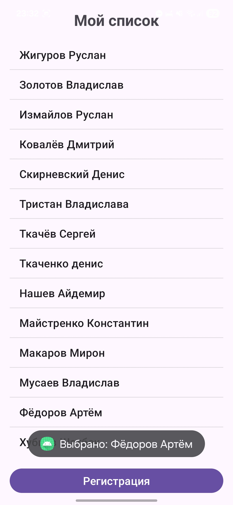
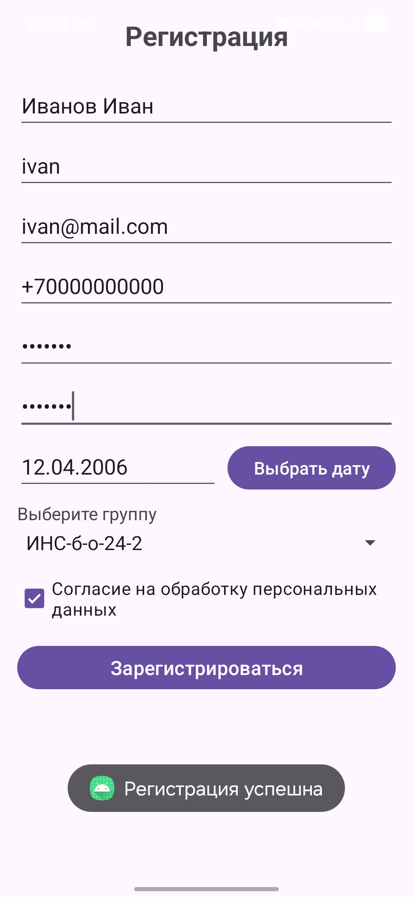

<div align="center">

# Отчёт

</div>

<div align="center">

## Практическая работа №7

</div>

<div align="center">

## Локализация и списки. Формы ввода и валидация данных

</div>

**Выполнил:** Деревянко Артём Владимирович<br>
**Курс:** 2<br>
**Группа:** ИНС-б-о-24-2<br>
**Направление:** 09.03.02 Информационные системы и технологии<br>
**Проверил:** Потапов Иван Романович

---

### Цель работы
Изучить механизмы локализации Android-приложений, научиться работать со списками (ListView, Spinner), освоить различные типы полей ввода и реализовать валидацию пользовательского ввода с использованием регулярных выражений.

### Ход работы
#### Задание 1: Создание проекта и локализация
1. Был открыт Android Studio и создан новый проект с шаблоном **Empty Views Activity**. Проекту дано имя `LocalizationAndFormsLab`.
2. В файле `res/values/strings.xml` определена строка `app_name` и строка `list_title` ("Мой список").
3. Созданы локализованные ресурсы для выбранного языка согласно вашему варианту (вар.1).
4. Добавлен TextView на главный экран, который отображает строку @string/list_title.
##### `res/values/strings.xml`
```xml
<?xml version="1.0" encoding="utf-8"?>
<resources>
    <string name="app_name">LocalizationAndFormsLab</string>
    <string name="list_title">Мой список</string>
    <string name="registration_title">Регистрация</string>
    <string name="fio_hint">ФИО</string>
    <string name="login_hint">Логин</string>
    <string name="email_hint">Email</string>
    <string name="phone_hint">Номер телефона</string>
    <string name="password_hint">Пароль</string>
    <string name="confirm_password_hint">Подтвердите пароль</string>
    <string name="birth_date_hint">Дата рождения</string>
    <string name="select_group">Выберите группу</string>
    <string name="consent">Согласие на обработку персональных данных</string>
    <string name="register">Зарегистрироваться</string>
    <string name="select_date">Выбрать дату</string>
</resources>
```
##### `res/values-en/strings.xml`
```xml
<?xml version="1.0" encoding="utf-8"?>
<resources>
    <string name="app_name">LocalizationAndFormsLab</string>
    <string name="list_title">My List</string>
    <string name="registration_title">Registration</string>
    <string name="fio_hint">Full Name</string>
    <string name="login_hint">Login</string>
    <string name="email_hint">Email</string>
    <string name="phone_hint">Phone Number</string>
    <string name="password_hint">Password</string>
    <string name="confirm_password_hint">Confirm Password</string>
    <string name="birth_date_hint">Date of Birth</string>
    <string name="select_group">Select Group</string>
    <string name="consent">Consent to personal data processing</string>
    <string name="register">Register</string>
    <string name="select_date">Select Date</string>
</resources>
```
##### `res/layout/activity_main.xml`
```xml
<?xml version="1.0" encoding="utf-8"?>
<LinearLayout
    xmlns:android="http://schemas.android.com/apk/res/android"
    android:layout_width="match_parent"
    android:layout_height="match_parent"
    android:orientation="vertical"
    android:padding="16dp">

    <TextView
        android:layout_width="match_parent"
        android:layout_height="wrap_content"
        android:text="@string/list_title"
        android:textSize="24sp"
        android:textStyle="bold"
        android:gravity="center"
        android:layout_marginBottom="16dp"/>

    <ListView
        android:id="@+id/listView"
        android:layout_width="match_parent"
        android:layout_height="0dp"
        android:layout_weight="1"
        android:layout_marginBottom="16dp"/>

    <Button
        android:id="@+id/btnRegistration"
        android:layout_width="match_parent"
        android:layout_height="wrap_content"
        android:text="@string/registration_title"
        android:textSize="16sp"/>

</LinearLayout>
```
<br>


#### Задание 2: Работа со списком ListView
1. В `strings.xml` создан массив строк согласно варианту (вар.1)
2. В разметку `activity_main.xml` добавлено `ListView`.
3. В `MainActivity.java` получен массив из ресурсов, создан `ArrayAdapter` и применён к `ListView`.
4. Добавлен обработчик `setOnItemClickListener`, который показывает Toast с выбранным элементом.
##### Массив строк в `res/values/strings.xml`
```xml
<string-array name="groupmates_array">
    <item>Анагурбанов Байрам</item>
    <item>Арустамов Артур</item>
    <item>Атаян ливон</item>
    <item>Айбазов Умар</item>
    <item>Баркетов Родион</item>
    <item>Болонина Валерия</item>
    <item>Братов Амир</item>
    <item>Волуйский Даниил</item>
    <item>Жигуров Руслан</item>
    <item>Золотов Владислав</item>
    <item>Измайлов Руслан</item>
    <item>Ковалёв Дмитрий</item>
    <item>Скирневский Денис</item>
    <item>Тристан Владислава</item>
    <item>Ткачёв Сергей</item>
    <item>Ткаченко денис</item>
    <item>Нашев Айдемир</item>
    <item>Майстренко Константин</item>
    <item>Макаров Мирон</item>
    <item>Мусаев Владислав</item>
    <item>Фёдоров Артём</item>
    <item>Хубиев Шатбек</item>
</string-array>
```
##### Массив строк в `res/values-en/strings.xml`
```xml
<string-array name="groupmates_array">
    <item>Anagurbanov Bayram</item>
    <item>Artur Arustamov</item>
    <item>Atayan Livon</item>
    <item>Umar Aybazov</item>
    <item>Rodion Barketov</item>
    <item>Valeria Bolonina</item>
    <item>Bratov Amir</item>
    <item>Daniil Voluysky</item>
    <item>Ruslan Zhigurov</item>
    <item>Vladislav Zolotov</item>
    <item>Ruslan Izmailov</item>
    <item>Dmitry Kovalev</item>
    <item>Denis Skirnevsky</item>
    <item>Tristan Vladislava</item>
    <item>Sergey Tkachev</item>
    <item>Denis Tkachenko</item>
    <item>Aydemir Nashev</item>
    <item>Konstantin Maistrenko</item>
    <item>Makarov Miron</item>
    <item>Vladislav Musaev</item>
    <item>Artem Fedorov</item>
    <item>Khubiev Shatbek</item>
</string-array>
```
##### `MainActivity.java`
```java
package com.example.localizationandformslab;

import android.content.Intent;
import android.os.Bundle;
import android.view.View;
import android.widget.AdapterView;
import android.widget.ArrayAdapter;
import android.widget.Button;
import android.widget.ListView;
import android.widget.Toast;
import androidx.appcompat.app.AppCompatActivity;

public class MainActivity extends AppCompatActivity {

    private ListView listView;
    private Button btnRegistration;

    @Override
    protected void onCreate(Bundle savedInstanceState) {
        super.onCreate(savedInstanceState);
        setContentView(R.layout.activity_main);

        listView = findViewById(R.id.listView);
        btnRegistration = findViewById(R.id.btnRegistration);

        // Получаем массив из ресурсов
        String[] groupmates = getResources().getStringArray(R.array.groupmates_array);

        // Создаем адаптер
        ArrayAdapter<String> adapter = new ArrayAdapter<>(
                this,
                android.R.layout.simple_list_item_1,
                groupmates
        );

        // Применяем адаптер к ListView
        listView.setAdapter(adapter);

        // Обработчик нажатия на элемент списка
        listView.setOnItemClickListener(new AdapterView.OnItemClickListener() {
            @Override
            public void onItemClick(AdapterView<?> parent, View view, int position, long id) {
                String selected = parent.getItemAtPosition(position).toString();
                Toast.makeText(MainActivity.this,
                        "Выбрано: " + selected,
                        Toast.LENGTH_SHORT).show();
            }
        });

        // Переход к форме регистрации
        btnRegistration.setOnClickListener(new View.OnClickListener() {
            @Override
            public void onClick(View v) {
                Intent intent = new Intent(MainActivity.this, RegistrationActivity.class);
                startActivity(intent);
            }
        });
    }
}
```

#### Задание 3: Создание формы регистрации
1. Создана новая Activity `RegistrationActivity` и соответствующая разметка `activity_registration.xml`.
2. Добавлены на форму следующие поля (использованы `TextInputLayout` из библиотеки Material Design для красоты или обычные `EditText`):
- ФИО (EditText)
- Логин (EditText)
- Email (EditText)
- Номер телефона (EditText)
- Пароль (EditText, inputType="textPassword")
- Повтор пароля (EditText, inputType="textPassword")
- Дата рождения (EditText + кнопка для вызова DatePickerDialog)
- Spinner для выбора из списка согласно варианту
- CheckBox "Согласие на обработку персональных данных"
- Кнопка "Зарегистрироваться"
3. Реализована валидация всех полей по заданным правилам. При ошибке поле подсвечивается с помощью `setError()` и выводится сообщение в `Logcat`.
##### `activity_registration.xml`
```xml
<?xml version="1.0" encoding="utf-8"?>
<ScrollView
    xmlns:android="http://schemas.android.com/apk/res/android"
    android:layout_width="match_parent"
    android:layout_height="match_parent"
    android:padding="16dp">

    <LinearLayout
        android:layout_width="match_parent"
        android:layout_height="wrap_content"
        android:orientation="vertical">

        <TextView
            android:layout_width="match_parent"
            android:layout_height="wrap_content"
            android:text="@string/registration_title"
            android:textSize="24sp"
            android:textStyle="bold"
            android:gravity="center"
            android:layout_marginBottom="24dp"/>

        <!-- ФИО -->
        <EditText
            android:id="@+id/etFio"
            android:layout_width="match_parent"
            android:layout_height="wrap_content"
            android:hint="@string/fio_hint"
            android:inputType="textPersonName"
            android:layout_marginBottom="8dp"/>

        <!-- Логин -->
        <EditText
            android:id="@+id/etLogin"
            android:layout_width="match_parent"
            android:layout_height="wrap_content"
            android:hint="@string/login_hint"
            android:inputType="text"
            android:layout_marginBottom="8dp"/>

        <!-- Email -->
        <EditText
            android:id="@+id/etEmail"
            android:layout_width="match_parent"
            android:layout_height="wrap_content"
            android:hint="@string/email_hint"
            android:inputType="textEmailAddress"
            android:layout_marginBottom="8dp"/>

        <!-- Телефон -->
        <EditText
            android:id="@+id/etPhone"
            android:layout_width="match_parent"
            android:layout_height="wrap_content"
            android:hint="@string/phone_hint"
            android:inputType="phone"
            android:layout_marginBottom="8dp"/>

        <!-- Пароль -->
        <EditText
            android:id="@+id/etPassword"
            android:layout_width="match_parent"
            android:layout_height="wrap_content"
            android:hint="@string/password_hint"
            android:inputType="textPassword"
            android:layout_marginBottom="8dp"/>

        <!-- Подтверждение пароля -->
        <EditText
            android:id="@+id/etConfirmPassword"
            android:layout_width="match_parent"
            android:layout_height="wrap_content"
            android:hint="@string/confirm_password_hint"
            android:inputType="textPassword"
            android:layout_marginBottom="8dp"/>

        <!-- Дата рождения -->
        <LinearLayout
            android:layout_width="match_parent"
            android:layout_height="wrap_content"
            android:orientation="horizontal"
            android:layout_marginBottom="8dp">

            <EditText
                android:id="@+id/etBirthDate"
                android:layout_width="0dp"
                android:layout_height="wrap_content"
                android:layout_weight="1"
                android:hint="@string/birth_date_hint"
                android:inputType="none"
                android:focusable="false"
                android:clickable="true"/>

            <Button
                android:id="@+id/btnSelectDate"
                android:layout_width="wrap_content"
                android:layout_height="wrap_content"
                android:text="@string/select_date"
                android:layout_marginStart="8dp"/>
        </LinearLayout>

        <!-- Spinner для выбора группы -->
        <TextView
            android:layout_width="match_parent"
            android:layout_height="wrap_content"
            android:text="@string/select_group"
            android:layout_marginBottom="4dp"/>

        <Spinner
            android:id="@+id/spinnerGroup"
            android:layout_width="match_parent"
            android:layout_height="wrap_content"
            android:layout_marginBottom="16dp"/>

        <!-- CheckBox согласия -->
        <CheckBox
            android:id="@+id/cbAgree"
            android:layout_width="match_parent"
            android:layout_height="wrap_content"
            android:text="@string/consent"
            android:layout_marginBottom="16dp"/>

        <!-- Кнопка регистрации -->
        <Button
            android:id="@+id/btnRegister"
            android:layout_width="match_parent"
            android:layout_height="wrap_content"
            android:text="@string/register"
            android:textSize="16sp"/>

    </LinearLayout>
</ScrollView>
```

#### Задание 4: Реализация валидации
##### `RegistrationActivity.java`
```java
package com.example.localizationandformslab;

import android.app.DatePickerDialog;
import android.os.Bundle;
import android.util.Log;
import android.view.View;
import android.widget.AdapterView;
import android.widget.ArrayAdapter;
import android.widget.Button;
import android.widget.CheckBox;
import android.widget.DatePicker;
import android.widget.EditText;
import android.widget.Spinner;
import android.widget.Toast;
import androidx.appcompat.app.AppCompatActivity;

import java.util.Calendar;

public class RegistrationActivity extends AppCompatActivity {

    private static final String TAG = "Registration";

    private EditText etFio, etLogin, etEmail, etPhone;
    private EditText etPassword, etConfirmPassword, etBirthDate;
    private Button btnSelectDate, btnRegister;
    private Spinner spinnerGroup;
    private CheckBox cbAgree;

    private String selectedBirthDate = "";

    @Override
    protected void onCreate(Bundle savedInstanceState) {
        super.onCreate(savedInstanceState);
        setContentView(R.layout.activity_registration);

        // Инициализация элементов
        etFio = findViewById(R.id.etFio);
        etLogin = findViewById(R.id.etLogin);
        etEmail = findViewById(R.id.etEmail);
        etPhone = findViewById(R.id.etPhone);
        etPassword = findViewById(R.id.etPassword);
        etConfirmPassword = findViewById(R.id.etConfirmPassword);
        etBirthDate = findViewById(R.id.etBirthDate);
        btnSelectDate = findViewById(R.id.btnSelectDate);
        spinnerGroup = findViewById(R.id.spinnerGroup);
        cbAgree = findViewById(R.id.cbAgree);
        btnRegister = findViewById(R.id.btnRegister);

        // Настройка Spinner
        String[] groups = {"ИНС-б-о-24-1", "ИНС-б-о-24-2", "ИНС-б-о-25"};
        ArrayAdapter<String> adapter = new ArrayAdapter<>(
                this,
                android.R.layout.simple_spinner_item,
                groups
        );
        adapter.setDropDownViewResource(android.R.layout.simple_spinner_dropdown_item);
        spinnerGroup.setAdapter(adapter);

        // Обработчик выбора даты
        btnSelectDate.setOnClickListener(new View.OnClickListener() {
            @Override
            public void onClick(View v) {
                showDatePickerDialog();
            }
        });

        etBirthDate.setOnClickListener(new View.OnClickListener() {
            @Override
            public void onClick(View v) {
                showDatePickerDialog();
            }
        });

        // Обработчик кнопки регистрации
        btnRegister.setOnClickListener(new View.OnClickListener() {
            @Override
            public void onClick(View v) {
                onRegisterClick();
            }
        });
    }

    private void showDatePickerDialog() {
        Calendar calendar = Calendar.getInstance();
        int year = calendar.get(Calendar.YEAR);
        int month = calendar.get(Calendar.MONTH);
        int day = calendar.get(Calendar.DAY_OF_MONTH);

        DatePickerDialog datePickerDialog = new DatePickerDialog(
                this,
                new DatePickerDialog.OnDateSetListener() {
                    @Override
                    public void onDateSet(DatePicker view, int year, int month, int dayOfMonth) {
                        selectedBirthDate = String.format("%02d.%02d.%04d",
                                dayOfMonth, month + 1, year);
                        etBirthDate.setText(selectedBirthDate);
                    }
                },
                year, month, day
        );
        datePickerDialog.show();
    }

    private void onRegisterClick() {
        String fio = etFio.getText().toString().trim();
        String login = etLogin.getText().toString().trim();
        String email = etEmail.getText().toString().trim();
        String phone = etPhone.getText().toString().trim();
        String password = etPassword.getText().toString();
        String confirmPassword = etConfirmPassword.getText().toString();
        String birthDate = etBirthDate.getText().toString().trim();
        boolean isAgreed = cbAgree.isChecked();

        boolean isValid = true;

        // Валидация ФИО (только кириллица, пробелы и дефис)
        if (!fio.matches("^[А-Яа-яЁё\\s-]+$")) {
            etFio.setError("Только русские буквы, пробелы и дефис");
            Log.w(TAG, "Неверный формат ФИО: " + fio);
            isValid = false;
        }

        // Валидация логина (только латиница)
        if (!login.matches("^[A-Za-z]+$")) {
            etLogin.setError("Только латинские буквы");
            Log.w(TAG, "Неверный формат логина: " + login);
            isValid = false;
        }

        // Валидация email
        if (!email.matches("^[A-Za-z0-9._%+-]+@[A-Za-z0-9.-]+\\.[A-Za-z]{2,}$")) {
            etEmail.setError("Неверный формат email");
            Log.w(TAG, "Неверный формат email: " + email);
            isValid = false;
        }

        // Валидация телефона (формат +7XXXXXXXXXX)
        if (!phone.matches("^\\+7\\d{10}$")) {
            etPhone.setError("Формат: +7XXXXXXXXXX");
            Log.w(TAG, "Неверный формат телефона: " + phone);
            isValid = false;
        }

        // Валидация пароля (минимум 6 символов, хотя бы одна цифра и заглавная буква)
        if (password.length() < 6) {
            etPassword.setError("Пароль должен быть не менее 6 символов");
            Log.w(TAG, "Слишком короткий пароль");
            isValid = false;
        } else if (!password.matches(".*\\d.*") || !password.matches(".*[A-Z].*")) {
            etPassword.setError("Пароль должен содержать хотя бы одну цифру и заглавную букву");
            Log.w(TAG, "Пароль не соответствует требованиям сложности");
            isValid = false;
        }

        // Проверка совпадения паролей
        if (!password.equals(confirmPassword)) {
            etConfirmPassword.setError("Пароли не совпадают");
            Log.w(TAG, "Пароли не совпадают");
            isValid = false;
        }

        // Валидация даты рождения
        if (!birthDate.matches("^(0[1-9]|[12][0-9]|3[01])\\.(0[1-9]|1[012])\\.(19|20)\\d{2}$")) {
            etBirthDate.setError("Формат: ДД.ММ.ГГГГ");
            Log.w(TAG, "Неверный формат даты: " + birthDate);
            isValid = false;
        } else {
            // Проверка диапазона дат (1900 - текущий год)
            try {
                String[] parts = birthDate.split("\\.");
                int day = Integer.parseInt(parts[0]);
                int month = Integer.parseInt(parts[1]);
                int year = Integer.parseInt(parts[2]);

                Calendar birthCalendar = Calendar.getInstance();
                birthCalendar.set(year, month - 1, day);

                Calendar now = Calendar.getInstance();
                Calendar minDate = Calendar.getInstance();
                minDate.set(1900, 0, 1);

                if (birthCalendar.after(now) || birthCalendar.before(minDate)) {
                    etBirthDate.setError("Дата должна быть между 1900 и текущей датой");
                    Log.w(TAG, "Дата вне допустимого диапазона: " + birthDate);
                    isValid = false;
                }
            } catch (Exception e) {
                etBirthDate.setError("Неверная дата");
                Log.w(TAG, "Ошибка парсинга даты: " + e.getMessage());
                isValid = false;
            }
        }

        // Проверка согласия
        if (!isAgreed) {
            cbAgree.setError("Необходимо согласие");
            Log.w(TAG, "Согласие не отмечено");
            isValid = false;
        }

        if (isValid) {
            Toast.makeText(this, "Регистрация успешна", Toast.LENGTH_LONG).show();
            Log.i(TAG, "Регистрация успешна: " + fio);
            // Здесь можно сохранить данные или перейти к следующей активности
        } else {
            Toast.makeText(this, "Исправьте ошибки в форме", Toast.LENGTH_LONG).show();
        }
    }
}
```
<br>


### Вывод
В результате выполнения практической работы были изучены механизмы локализации Android-приложений, получены навыки работы со списками (ListView, Spinner), освоены различные типы полей ввода и реализована валидация пользовательского ввода с использованием регулярных выражений.

### Ответы на контрольные вопросы
1. Как в Android реализуется локализация приложений? Опишите структуру папок для поддержки нескольких языков.<br>
Локализация реализуется через создание папок-квалификаторов в `res/`. Основная структура:
- `res/values/strings.xml` — строки по умолчанию
- `res/values-ru/strings.xml` — для русского языка
- `res/values-en/strings.xml` — для английского
- `res/values-de/strings.xml` — для немецкого и т.д.<br>
В каждой папке создаётся `strings.xml` с одинаковыми именами строк, но переведёнными значениями.

---

2. Для чего используются адаптеры (например, `ArrayAdapter`) при работе со списками `ListView` и `Spinner`?<br>
Адаптеры служат связующим звеном между источником данных (массив, список) и View-компонентом. `ArrayAdapter` преобразует каждый элемент данных в View для отображения в списке. Без адаптера `ListView`/`Spinner` не знают, какие данные показывать и как их отображать.

---

3. Какие атрибуты `EditText` позволяют ограничить тип вводимых данных? Приведите примеры.<br>
Атрибут `android:inputType`:
- `textPersonName` — имя человека
- `textEmailAddress` — email
- `textPassword` — пароль (скрытый ввод)
- `phone` — телефонный номер
- `number` — целое число
- `numberDecimal` — число с плавающей точкой
- `textMultiLine` — многострочный текст<br>
Дополнительно: `android:maxLength` (макс. длина), `android:digits` (разрешённые символы).

---

4. Что такое регулярные выражения? Как с их помощью проверить, что строка является валидным email-адресом?<br>
Регулярные выражения (regex) — шаблоны для поиска и проверки строк по заданному формату. В Java используется метод `String.matches(String regex)`.<br>
Пример проверки email:
```java
String email = "test@example.com";
if (email.matches("^[A-Za-z0-9._%+-]+@[A-Za-z0-9.-]+\\.[A-Za-z]{2,}$")) {
    // email валиден
}
```

---

5. Как программно установить ошибку на поле ввода (`EditText`), чтобы она отображалась пользователю?<br>
Используется метод `setError()`:
```java
EditText editText = findViewById(R.id.editText);
editText.setError("Неверный формат email");
```
Поле подсвечивается красным, показывается иконка с сообщением об ошибке.

---

6. В чём разница между `CheckBox` и `RadioGroup`? В каких случаях используется каждый из них?
- `CheckBox` — позволяет выбрать несколько вариантов одновременно (независимые переключатели).
- `RadioGroup` — группа `RadioButton`, где можно выбрать только один вариант (взаимоисключающие опции).<br>
**Примеры:**
- `CheckBox` — выбор дополнительных опций (доставка, страховка)
- `RadioGroup` — выбор пола, способа оплаты

---

7. Как вывести диалоговое окно для выбора даты (`DatePickerDialog`) и получить выбранное значение?
```java
Calendar calendar = Calendar.getInstance();
DatePickerDialog datePickerDialog = new DatePickerDialog(
    this,
    (view, year, month, dayOfMonth) -> {
        String selectedDate = dayOfMonth + "." + (month + 1) + "." + year;
        textView.setText(selectedDate);
    },
    calendar.get(Calendar.YEAR),
    calendar.get(Calendar.MONTH),
    calendar.get(Calendar.DAY_OF_MONTH)
);
datePickerDialog.show();
```

---

8. Для чего используется метод `String.matches()`? Что он возвращает?<br>
Метод `String.matches(String regex)` проверяет, соответствует ли строка заданному регулярному выражению.<br>
**Возвращает:**
- `true` — если строка полностью соответствует шаблону
- `false` — если не соответствует<br>
**Пример:**
```java
"123".matches("\\d+") // true (только цифры)
"abc".matches("\\d+") // false
```